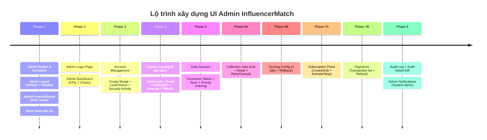

# 📋 KẾ HOẠCH TRIỂN KHAI GIAO DIỆN ADMIN - INFLUENCERMATCH

Tài liệu này đối soát toàn bộ sơ đồ màn hình Admin (Admin Screen Flow) với mã nguồn hiện tại, đồng thời đề ra lộ trình và kế hoạch xây dựng chi tiết. Dùng checkbox `[x]` để đánh dấu tiến trình.

---

## 🧭 I. TỔNG QUAN SƠ ĐỒ HỆ THỐNG ADMIN

```
[Admin Login] (JWT + Role check)
   │
   ▼
[Admin Layout] (Sidebar + Header + Rail)
   ├── 0. Admin Dropdown: Profile + Logout
   ├── 1. Notifications: System alerts
   ├── 2. Admin Dashboard: KPIs + Charts
   ├── 3. Account Management (List + Detail):
   │      ├── Create Admin Modal
   │      ├── Lock / Unlock / Restore (Status change)
   │      └── Security Activity (Last login)
   ├── 4. Creator Catalog (6 sub-tabs):
   │      ├── Creator List + Search (Filter, Hide, Inactive)
   │      ├── Add / Import (Manual, CSV, Dataset)
   │      ├── Creator Detail (Metadata + Social accounts)
   │      ├── Duplicates / Merge (Review + Merge)
   │      ├── External Discovered (Source + Status)
   │      └── Refresh Request (Public data)
   ├── 5. Data Sources (Connector list):
   │      ├── Connector Status (On / Off / Pause)
   │      ├── Sync & Rate-limit (Success / Fail count)
   │      └── Source Priority (Ordering)
   ├── 6. Collection Jobs (List + Filter):
   │      ├── Job Detail (Error message)
   │      └── Retry / Cancel (Actions)
   ├── 7. Scoring Config (4 sub-tabs):
   │      ├── Weights Editor (Sum = 100%)
   │      ├── Preview (sample data)
   │      ├── Version History (Save + Version)
   │      └── Rollback (Confirm Modal)
   ├── 8. Subscription Plans (List + Form):
   │      ├── Create / Edit Plan (Price, Quota)
   │      └── Activate / Stop (Status)
   ├── 9. Payments (Transaction list):
   │      ├── Transaction Detail (Ref, Status, Dates)
   │      └── Refund (Confirm Modal)
   └── 10. Audit Log (List + Filter):
          └── Audit Detail (Old / New value)
```

---

## 🔍 II. BẢNG ĐỐI SOÁT HIỆN TRẠNG (GAP ANALYSIS)

| STT | Phân hệ (Module) | Yêu cầu theo sơ đồ | Hiện trạng | Mức độ | Đánh giá |
|:---|:---|:---|:---|:---:|:---|
| **0** | **Admin Layout** | Sidebar + Header + Dropdown + Rail | Đã tích hợp hoàn thiện layout admin | 100% | 🟢 **Hoàn thành** |
| **1** | **Admin Login** | JWT + Role check `admin` | Đã dùng chung login Brand + check role admin | 100% | 🟢 **Hoàn thành** |
| **2** | **Admin Dashboard** | KPI Cards + Charts (Users, Revenue, Creators, Jobs) | Đã hoàn thiện đầy đủ KPIs & biểu đồ | 100% | 🟢 **Hoàn thành** |
| **3** | **Account Management** | List + Detail + Create Modal + Lock/Unlock + Security Activity | Đã hoàn thiện 5/5 components | 100% | 🟢 **Hoàn thành** |
| **4** | **Creator Catalog** | 6 sub-tabs: List, Add/Import, Detail, Duplicates, External, Refresh | Đã hoàn thiện container + 6 sub-tabs | 100% | 🟢 **Hoàn thành** |
| **5** | **Data Sources** | Connector Status + Sync & Rate-limit + Source Priority | Đã hoàn thiện 4/4 components | 100% | 🟢 **Hoàn thành** |
| **6** | **Collection Jobs & Scoring** | Jobs (Detail + Retry/Cancel) + Scoring (Weights + Preview + Rollback) | Đã hoàn thiện 8/8 components | 100% | 🟢 **Hoàn thành** |
| **7** | **Subscriptions & Payments** | Plans (Create/Edit + Active/Stop) + Payments (Detail + Refund) | Đã hoàn thiện 6/6 components | 100% | 🟢 **Hoàn thành** |
| **8** | **Audit Log & Notifications** | Audit Log + Diff Drawer + Notification Alerts Drawer | Đã hoàn thiện 3/3 components | 100% | 🟢 **Hoàn thành** |

---

## ✅ III. TIẾN TRÌNH THỰC HIỆN (PROGRESS TRACKING)

> **Cách dùng**: Đánh dấu `[x]` khi hoàn thành từng task. Cập nhật `%` ở bảng Gap Analysis.

---

### 🔴 PHASE 1 — Nền Tảng (Foundation)
> **Mục tiêu**: Admin routing, layout, auth guard, mock data

- [x] **1.1** Tạo `src/constants/adminRoutes.ts` — định nghĩa toàn bộ `/admin/*` routes
- [x] **1.2** Tạo `src/mock/adminData.ts` — mock data: accounts, creators, jobs, plans, transactions, audit logs
- [x] **1.3** Tạo `src/components/admin/AdminLayout.tsx` — wrapper: Sidebar + Header + `<Outlet />`
- [x] **1.4** Tạo `src/components/admin/AdminSidebar.tsx` — menu điều hướng với icons, active state
- [x] **1.5** Tạo `src/components/admin/AdminHeader.tsx` — Profile dropdown + Notification bell
- [x] **1.6** Tạo `src/components/admin/AdminProtectedRoute.tsx` — check `role === 'admin'`, redirect nếu không đủ quyền
- [x] **1.7** Cập nhật `src/App.tsx` — thêm `/admin/*` route group với nested routes

**Tiến độ Phase 1**: `7 / 7` tasks ✅✅✅✅✅✅✅

---

### 🔴 PHASE 2 — Admin Login + Dashboard
> **Mục tiêu**: Điểm vào admin + tổng quan KPI toàn hệ thống

- [x] **2.1** Tạo `src/pages/admin/AdminLoginPage.tsx`
  - Form email + password
  - Call mock auth, check `role === 'admin'`
  - Redirect `/admin/dashboard` nếu thành công
- [x] **2.2** Tạo `src/pages/admin/dashboard/AdminDashboardPage.tsx`
  - KPI Cards: Tổng Users, Active Creators, Revenue tháng này, Jobs đang chạy
  - Line Chart: Tăng trưởng Users theo tháng
  - Bar Chart: Doanh thu theo gói cước
  - Recent Activity Feed: 5-10 hoạt động gần nhất

**Tiến độ Phase 2**: `2 / 2` tasks ✅✅

---

### 🟠 PHASE 3 — Account Management
> **Mục tiêu**: Quản lý toàn bộ tài khoản (admin / brand / creator)

- [x] **3.1** Tạo `src/pages/admin/accounts/AccountManagementPage.tsx`
  - Table: Avatar | Tên | Email | Role | Trạng thái | Lần đăng nhập cuối | Actions
  - Filter: Role (Admin/Brand/Creator), Status (Active/Locked/Inactive), Search
  - Bulk action: Lock/Unlock nhiều tài khoản, Export CSV### 🟠 PHASE 4 — Creator Catalog (6 Sub-tabs)
> **Mục tiêu**: Quản lý toàn bộ creator trong hệ thống từ góc độ admin

- [x] **4.1** Tạo `src/pages/admin/creators/CreatorCatalogPage.tsx` — container với 6 tabs
- [x] **4.2** Tạo `src/pages/admin/creators/components/CreatorListTab.tsx`
  - Table: Avatar | Handle | Platform | Followers | ER% | Status | Actions
  - Search, Filter (platform, category, follower range, status)
  - Toggle Hide / Inactive per creator
- [x] **4.3** Tạo `src/pages/admin/creators/components/AddImportTab.tsx`
  - Form thêm manual: handle, platform, bio, categories
  - Upload CSV (với template download)
  - Dataset picker từ external sources
- [x] **4.4** Tạo `src/pages/admin/creators/components/CreatorDetailTab.tsx`
  - Profile: avatar, tên, bio, categories, location, joined date
  - Social accounts: platform + handle + followers + ER + last verified
  - Nút Edit Metadata
- [x] **4.5** Tạo `src/pages/admin/creators/components/DuplicatesMergeTab.tsx`
  - Danh sách cặp duplicate phát hiện được
  - So sánh side-by-side 2 profile
  - Chọn master record → Merge → Confirm
- [x] **4.6** Tạo `src/pages/admin/creators/components/ExternalDiscoveredTab.tsx`
  - Table: Handle | Source | Ngày phát hiện | Status (Pending/Approved/Rejected)
  - Action: Approve (thêm vào catalog) / Reject / Review
- [x] **4.7** Tạo `src/pages/admin/creators/components/RefreshRequestTab.tsx`
  - Queue các yêu cầu làm mới dữ liệu public
  - Status: Pending / Processing / Done / Failed
  - Action: Retry / Cancel request

**Tiến độ Phase 4**: `7 / 7` tasks ✅✅✅✅✅✅✅

---

### 🟡 PHASE 5 — Data Sources
> **Mục tiêu**: Quản lý connector đến các nền tảng mạng xã hội

- [x] **5.1** Tạo `src/pages/admin/datasources/DataSourcesPage.tsx`
  - Grid connector cards: Instagram, TikTok, YouTube, Twitter/X, Facebook...
  - Mỗi card: Logo | Status badge | Last sync | Success/Fail stats
- [x] **5.2** Tạo `src/pages/admin/datasources/components/ConnectorStatusCard.tsx`
  - Toggle ON / OFF / PAUSE per connector
  - Status indicator: 🟢 Active | 🔴 Error | 🟡 Paused
- [x] **5.3** Tạo `src/pages/admin/datasources/components/SyncRateLimitPanel.tsx`
  - Success count / Fail count / Total requests hôm nay
  - Rate limit config: requests/minute
  - Biểu đồ mini: sync success rate 7 ngày qua
- [x] **5.4** Tạo `src/pages/admin/datasources/components/SourcePriorityPanel.tsx`
  - Drag & drop list để đặt thứ tự ưu tiên nguồn dữ liệu
  - Save ordering button

**Tiến độ Phase 5**: `4 / 4` tasks ✅✅✅✅

---

### 🟡 PHASE 6 — Collection Jobs + Scoring Config
> **Mục tiêu**: Monitor background jobs + Cấu hình thuật toán chấm điểm creator

#### 6A — Collection Jobs
- [x] **6.1** Tạo `src/pages/admin/jobs/CollectionJobsPage.tsx`
  - Table: Job ID | Type | Status | Started | Duration | Source | Actions
  - Filter: Status (Running/Done/Failed/Cancelled), Type, Date range
  - Status badges: 🟢 Done | 🔵 Running | 🔴 Failed | ⚫ Cancelled
- [x] **6.2** Tạo `src/pages/admin/jobs/components/JobDetailModal.tsx`
  - Chi tiết job: Creator target, Duration, Log messages, Error message (nếu có)
  - Timestamp từng bước thực thi
- [x] **6.3** Tạo `src/pages/admin/jobs/components/RetryCancelActions.tsx`
  - Button Retry (chỉ khi status Failed/Cancelled)
  - Button Cancel (chỉ khi status Running/Pending)
  - Confirm popover trước khi thực hiện

#### 6B — Scoring Config
- [x] **6.4** Tạo `src/pages/admin/scoring/ScoringConfigPage.tsx` — container với 4 tabs
- [x] **6.5** Tạo `src/pages/admin/scoring/components/WeightsEditorTab.tsx`
  - Sliders: Engagement Rate, Follower Count, Growth Rate, Content Quality, Consistency...
  - Live sum counter: **phải = 100%** mới cho phép Save
  - Màu đỏ nếu sum ≠ 100%, màu xanh nếu hợp lệ
- [x] **6.6** Tạo `src/pages/admin/scoring/components/PreviewTab.tsx`
  - Chọn sample creators (3-5 người)
  - Hiển thị điểm tính toán theo weights hiện tại
  - So sánh với điểm trong database
- [x] **6.7** Tạo `src/pages/admin/scoring/components/VersionHistoryTab.tsx`
  - Timeline các version đã lưu: Version number | Date | Saved by | Notes
  - Badge: "Current" cho version đang dùng
- [x] **6.8** Tạo `src/pages/admin/scoring/components/RollbackModal.tsx`
  - Confirm rollback về version X
  - Hiển thị diff weights cũ vs mới
  - Nhập lý do rollback

**Tiến độ Phase 6**: `8 / 8` tasks ✅✅✅✅✅✅✅✅

---

### 🟡 PHASE 7 — Subscription Plans + Payments
> **Mục tiêu**: Quản lý gói dịch vụ và toàn bộ giao dịch thanh toán

#### 7A — Subscription Plans
- [x] **7.1** Tạo `src/pages/admin/subscriptions/SubscriptionPlansPage.tsx`
  - Plan cards: Free | Starter | Pro | Enterprise
  - Mỗi card: Tên, Giá/tháng, Giá/năm, Quota (searches, creators, campaigns), Status
  - Nút "+ Tạo Plan mới"
- [x] **7.2** Tạo `src/pages/admin/subscriptions/components/CreateEditPlanForm.tsx`
  - Form trong Drawer: Tên plan, Giá tháng, Giá năm, Mô tả, Quota config, Features list
  - Mode Create / Edit
- [x] **7.3** Tạo `src/pages/admin/subscriptions/components/ActivateStopToggle.tsx`
  - Toggle Active/Inactive per plan
  - Confirm trước khi Stop (nếu có users đang dùng)
  - Hiển thị số users đang dùng plan này

#### 7B — Payments
- [x] **7.4** Tạo `src/pages/admin/payments/PaymentsPage.tsx`
  - Table: Mã ref | Người dùng | Plan | Số tiền | Trạng thái | Ngày | Actions
  - Filter: Status (Paid/Pending/Refunded/Failed), Date range, Plan type
  - Summary stats: Total revenue, Refunded amount, Pending amount
- [x] **7.5** Tạo `src/pages/admin/payments/components/TransactionDetailModal.tsx`
  - Mã ref, Gateway (VNPAY/MoMo/Bank), Ngày tạo, Ngày thanh toán
  - User info, Plan purchased, Amount, Status
  - Timeline trạng thái giao dịch
- [x] **7.6** Tạo `src/pages/admin/payments/components/RefundModal.tsx`
  - Confirm hoàn tiền với lý do bắt buộc (Reason)
  - Hiển thị số tiền sẽ hoàn
  - Warning nếu đã quá 30 ngày

**Tiến độ Phase 7**: `6 / 6` tasks ✅✅✅✅✅✅

---

### 🟢 PHASE 8 — Audit Log + Notifications
> **Mục tiêu**: Theo dõi mọi thay đổi trong hệ thống + cảnh báo hệ thống

- [x] **8.1** Tạo `src/pages/admin/audit/AuditLogPage.tsx`
  - Table: Timestamp | Actor (admin) | Action | Resource type | Resource ID | IP Address
  - Filter: Action type, Date range, Actor, Resource type
  - Màu action: 🔵 CREATE | 🟡 UPDATE | 🔴 DELETE | 🟢 LOGIN
- [x] **8.2** Tạo `src/pages/admin/audit/components/AuditDetailDrawer.tsx`
  - Side-by-side diff: **Old Value** (JSON) vs **New Value** (JSON)
  - Highlight các field thay đổi
  - Actor info: tên, email, IP, user agent
- [x] **8.3** Cập nhật `src/components/admin/AdminHeader.tsx`
  - Notification bell: hiển thị system alerts
  - Phân loại: 🔴 Error | 🟡 Warning | 🔵 Info
  - Click vào → Drawer danh sách alerts với timestamp
**Tiến độ Phase 8**: `3 / 3` tasks ✅✅✅

---

## 📅 IV. LỘ TRÌNH TRIỂN KHAI



---

## 📌 V. CẤU TRÚC FILE ĐỀ XUẤT

```
src/
├── constants/
│   └── adminRoutes.ts                          [MỚI - Phase 1]
├── mock/
│   └── adminData.ts                            [MỚI - Phase 1]
├── components/
│   └── admin/
│       ├── AdminLayout.tsx                     [MỚI - Phase 1]
│       ├── AdminSidebar.tsx                    [MỚI - Phase 1]
│       ├── AdminHeader.tsx                     [MỚI - Phase 1, cập nhật Phase 8]
│       └── AdminProtectedRoute.tsx             [MỚI - Phase 1]
├── pages/
│   └── admin/
│       ├── AdminLoginPage.tsx                  [MỚI - Phase 2]
│       ├── dashboard/
│       │   └── AdminDashboardPage.tsx          [MỚI - Phase 2]
│       ├── accounts/
│       │   ├── AccountManagementPage.tsx       [MỚI - Phase 3]
│       │   ├── AccountDetailPage.tsx           [MỚI - Phase 3]
│       │   └── components/
│       │       ├── CreateAdminModal.tsx        [MỚI - Phase 3]
│       │       ├── LockUnlockModal.tsx         [MỚI - Phase 3]
│       │       └── SecurityActivityPanel.tsx   [MỚI - Phase 3]
│       ├── creators/
│       │   ├── CreatorCatalogPage.tsx          [MỚI - Phase 4]
│       │   └── components/
│       │       ├── CreatorListTab.tsx          [MỚI - Phase 4]
│       │       ├── AddImportTab.tsx            [MỚI - Phase 4]
│       │       ├── CreatorDetailTab.tsx        [MỚI - Phase 4]
│       │       ├── DuplicatesMergeTab.tsx      [MỚI - Phase 4]
│       │       ├── ExternalDiscoveredTab.tsx   [MỚI - Phase 4]
│       │       └── RefreshRequestTab.tsx       [MỚI - Phase 4]
│       ├── datasources/
│       │   ├── DataSourcesPage.tsx             [MỚI - Phase 5]
│       │   └── components/
│       │       ├── ConnectorStatusCard.tsx     [MỚI - Phase 5]
│       │       ├── SyncRateLimitPanel.tsx      [MỚI - Phase 5]
│       │       └── SourcePriorityPanel.tsx     [MỚI - Phase 5]
│       ├── jobs/
│       │   ├── CollectionJobsPage.tsx          [MỚI - Phase 6A]
│       │   └── components/
│       │       ├── JobDetailModal.tsx          [MỚI - Phase 6A]
│       │       └── RetryCancelActions.tsx      [MỚI - Phase 6A]
│       ├── scoring/
│       │   ├── ScoringConfigPage.tsx           [MỚI - Phase 6B]
│       │   └── components/
│       │       ├── WeightsEditorTab.tsx        [MỚI - Phase 6B]
│       │       ├── PreviewTab.tsx              [MỚI - Phase 6B]
│       │       ├── VersionHistoryTab.tsx       [MỚI - Phase 6B]
│       │       └── RollbackModal.tsx           [MỚI - Phase 6B]
│       ├── subscriptions/
│       │   ├── SubscriptionPlansPage.tsx       [MỚI - Phase 7A]
│       │   └── components/
│       │       ├── CreateEditPlanForm.tsx      [MỚI - Phase 7A]
│       │       └── ActivateStopToggle.tsx      [MỚI - Phase 7A]
│       ├── payments/
│       │   ├── PaymentsPage.tsx                [MỚI - Phase 7B]
│       │   └── components/
│       │       ├── TransactionDetailModal.tsx  [MỚI - Phase 7B]
│       │       └── RefundModal.tsx             [MỚI - Phase 7B]
│       └── audit/
│           ├── AuditLogPage.tsx                [MỚI - Phase 8]
│           └── components/
│               └── AuditDetailDrawer.tsx       [MỚI - Phase 8]
└── router/
    └── index.jsx                               [CẬP NHẬT - Phase 1]
```

---

## 📊 VI. TỔNG KẾT TIẾN ĐỘ

| Phase | Tên | Số Tasks | Đã xong | Trạng thái |
|:------|:----|:--------:|:-------:|:----------:|
| 1 | Foundation (Layout + Routing) | 7 | 7 | ✅ Hoàn thành |
| 2 | Admin Login + Dashboard | 2 | 2 | ✅ Hoàn thành |
| 3 | Account Management | 5 | 5 | ✅ Hoàn thành |
| 4 | Creator Catalog (6 tabs) | 7 | 7 | ✅ Hoàn thành |
| 5 | Data Sources | 4 | 4 | ✅ Hoàn thành |
| 6 | Collection Jobs + Scoring Config | 8 | 8 | ✅ Hoàn thành |
| 7 | Subscription Plans + Payments | 6 | 6 | ✅ Hoàn thành |
| 8 | Audit Log + Notifications | 3 | 3 | ✅ Hoàn thành |
| **TOTAL** | | **42** | **42** | **100%** |

---

## 🎨 VII. DESIGN SYSTEM ADMIN

```
Màu sắc:
  Primary:      #6366F1  (Indigo 500)
  Danger:       #EF4444  (Red 500)
  Success:      #10B981  (Emerald 500)
  Warning:      #F59E0B  (Amber 500)
  Background:   #0F172A  (Slate 900) — Dark mode
  Surface:      #1E293B  (Slate 800)
  Border:       #334155  (Slate 700)
  Text Primary: #F1F5F9  (Slate 100)
  Text Muted:   #94A3B8  (Slate 400)

Typography:
  Font Family:  'Inter', sans-serif (Google Fonts)
  Heading:      700 weight
  Body:         400 weight

Spacing & Shape:
  Border Radius: 12px (cards), 8px (buttons/inputs)
  Card Shadow:   0 4px 24px rgba(0,0,0,0.3)
  Sidebar width: 240px (expanded), 64px (collapsed)

Route prefix: /admin/*  (tách biệt hoàn toàn với Brand routes)
```

---

> **Ghi chú**: File này là nguồn sự thật (source of truth) cho tiến trình phát triển Admin UI.
> Khi làm xong từng task, đánh dấu `[x]` và cập nhật số tasks đã xong trong bảng Tổng Kết.
> Lần làm tiếp, chỉ cần hỏi AI: *"Tiếp tục từ Phase X task Y"* là sẽ biết ngay ngữ cảnh.
