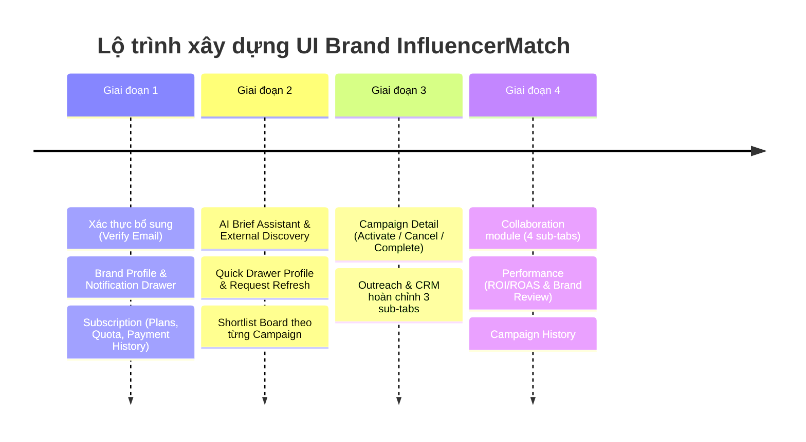

# 📋 KẾ HOẠCH TRIỂN KHAI GIAO DIỆN BRAND (NHÃN HÀNG) - INFLUENCERMATCH

Tài liệu này đối soát toàn bộ sơ đồ kiến trúc quy trình người dùng Brand (Site Map / Flowchart) với mã nguồn hiện tại của dự án, đồng thời đề ra lộ trình và kế hoạch xây dựng chi tiết cho các màn hình/tính năng còn thiếu.

---

## 🧭 I. TỔNG QUAN SƠ ĐỒ HỆ THỐNG BRAND

```
[Brand Login] (Đăng ký / Xác minh email / Quên MK)
   │
   ▼
[Brand Layout] (Sidebar + Header + Bell)
   ├── 1. Brand Dropdown: Tài khoản + Logout
   ├── 2. Notifications: In-app + Email alerts
   ├── 3. Brand Profile: Business, Industry, Target
   ├── 4. Subscription (3 tabs):
   │      ├── Plans / Upgrade (Mua, gia hạn)
   │      ├── Quota còn lại (Campaign, Refresh, Discovery)
   │      └── Payment History (Transaction list)
   ├── 5. Campaigns (List + Status):
   │      ├── Create / Edit Campaign (Save Draft)
   │      └── Campaign Detail (Activate / Cancel / Complete)
   ├── 6. AI Creator Discovery (5 sub-screens):
   │      ├── AI Brief Assistant (NL → structured brief)
   │      ├── Search + Filters (Niche, Platform, Price...)
   │      ├── Recommendation Result (Score + AI Explanation)
   │      ├── Creator Profile (Drawer + Request Refresh)
   │      └── Discover More (External Discovery)
   ├── 7. Shortlist (Per Campaign):
   │      ├── Shortlist Board (Note / Favorite / Priority)
   │      └── Creator Comparison (3-5 Creators)
   ├── 8. Outreach & CRM (3 sub-tabs):
   │      ├── Outreach Email (AI Draft + Send)
   │      ├── Relationship CRM (Stage + Notes)
   │      └── Invitation (Fee + Deliverable + Deadline)
   ├── 9. Collaboration (4 sub-tabs):
   │      ├── Collaboration List (Status tracking)
   │      ├── Deliverable Review (Comment / Review / Approve)
   │      ├── Fee Tracking (Agreed / Paid / Evidence)
   │      └── KPI Entry (Views, Orders, Revenue)
   ├── 10. Performance (2 sub-tabs):
   │      ├── ROI / ROAS (Self-reported flag)
   │      └── Brand Review (Structured rating)
   └── 11. Campaign History: Cost + KPI + Review
```

---

## 🔍 II. BẢNG ĐỐI SOÁT HIỆN TRẠNG (GAP ANALYSIS)

| STT | Phân hệ (Module) | Yêu cầu theo sơ đồ | Hiện trạng trong Code | Mức độ hoàn thiện | Đánh giá |
|:---|:---|:---|:---|:---:|:---|
| **1** | **Brand Login & Auth** | Đăng ký, Đăng nhập, Quên MK, **Xác minh Email / OTP** | Đã có `LoginPage`, `RegisterPage`, `ForgotPasswordPage`, `ResetPasswordPage`. | 80% | 🟡 Thiếu màn hình **Verify Email / OTP** |
| **2** | **Brand Layout & Topbar** | Header + Sidebar + Bell + Brand Dropdown | Đã có Layout + `NotificationDrawer` (In-app alerts & Email settings) + Menu điều hướng đầy đủ. | 100% | 🟢 **Hoàn thành** |
| **3** | **Brand Profile** | Business, Industry, Target market, Guidelines | Đã có `BrandProfilePage` (4 tabs: Doanh nghiệp, Ngành hàng, Target Persona, Brand Guidelines). | 100% | 🟢 **Hoàn thành** |
| **4** | **Subscription** | • Plans / Upgrade<br>• Quota còn lại<br>• Payment History | Đã có `SubscriptionPage` (3 tabs: Plans/Upgrade, Quota còn lại, Payment History + Modal hóa đơn VAT + Widget Sidebar). | 100% | 🟢 **Hoàn thành** |
| **5** | **Campaigns** | • List + Status<br>• Create / Edit Campaign<br>• **Campaign Detail** (Activate / Cancel / Complete) | Đã có `CampaignListPage`, `CreateCampaignPage`, và `CampaignDetailPage` (quản lý vòng đời Kích hoạt / Tạm dừng / Hoàn thành / Hủy, tóm tắt Brief, Creator tham gia, ngân sách, timeline). | 100% | 🟢 **Hoàn thành** |
| **6** | **AI Creator Discovery** | • AI Brief Assistant (NL → Brief)<br>• Search + Filters<br>• Score + AI Explanation<br>• Creator Profile (Drawer + Request Refresh)<br>• Discover More (External Discovery) | Đã có đầy đủ 5 thành phần: `AiBriefAssistant` (NL → Structured brief), bộ lọc chuyên sâu, Badge lý giải AI (Explanation), Quick Drawer xem nhanh với nút Request Refresh, và tab `ExternalDiscovery` quét kênh ngoài. | 100% | 🟢 **Hoàn thành** |
| **7** | **Shortlist** | • Shortlist Board (Per Campaign, Note, Fav, Priority)<br>• Creator Comparison (3-5 creators) | Đã có bảng so sánh `CreatorShortlistPage`. Chưa có Shortlist Board lọc theo từng campaign. | 50% | 🟡 Cần tách/bổ sung Shortlist Board |
| **8** | **Outreach & CRM** | • Outreach Email (AI Draft + Send)<br>• Relationship CRM (Stage + Notes)<br>• Invitation (Fee + Deliverable + Deadline) | Đã có Kanban sơ khởi trong `CampaignManagementPage`. Chưa có tab soạn email AI và quản lý lời mời chính thức. | 40% | 🟡 Cần hoàn thiện 3 sub-tabs |
| **9** | **Collaboration** | • Collaboration List<br>• Deliverable Review<br>• Fee Tracking<br>• KPI Entry | Chưa có phân hệ quản lý sau khi chốt hợp tác. | 0% | 🔴 **Thiếu hoàn toàn** |
| **10** | **Performance** | • ROI / ROAS (Self-reported flag)<br>• Brand Review (Structured rating) | Chưa có trang phân tích hiệu suất và đánh giá creator. | 0% | 🔴 **Thiếu hoàn toàn** |
| **11** | **Campaign History** | Cost + KPI + Review của các chiến dịch đã lưu trữ | Chưa có trang tổng kết lịch sử. | 0% | 🔴 **Thiếu hoàn toàn** |

---

## 🛠️ III. CHI TIẾT CÁC MÀN HÌNH CẦN THIẾT KẾ VÀ XÂY DỰNG MỚI

### 1. Phân hệ Tài khoản & Xác thực
- **`VerifyEmailPage` (`/verify-email`)**:
  - Giao diện nhập mã xác thực OTP 6 ô hoặc xác nhận kích hoạt từ email.
  - Đồng hồ đếm ngược gửi lại mã (Resend OTP).
- **`BrandProfilePage` (`/brand-profile`)**:
  - **Business Info**: Tên thương hiệu, Logo, Giấy phép ĐKKD, Website, Kênh truyền thông.
  - **Industry & Niche**: Lĩnh vực (Làm đẹp, Thời trang, Ẩm thực, Công nghệ...).
  - **Target Persona**: Chân dung khách hàng mục tiêu (Độ tuổi, giới tính, khu vực địa lý, thu nhập).
  - **Brand Assets**: Guideline màu sắc, logo vector, câu chuyện thương hiệu.
- **`NotificationDrawer` (Header Modal/Drawer)**:
  - Danh sách thông báo in-app (Tin nhắn mới, Creator nộp bài duyệt, Quota sắp hết...).
  - Tab cài đặt: Bật/tắt nhận Email Alert theo từng sự kiện.

### 2. Phân hệ Gói cước & Hạn mức (`SubscriptionPage` - 3 Tabs)
- **Tab 1 - Plans / Upgrade (`/subscription?tab=plans`)**:
  - Bảng so sánh 3-4 gói (Starter, Pro, Enterprise) theo tháng/năm.
  - Nút Mua mới / Nâng cấp / Gia hạn, tích hợp modal chọn phương thức thanh toán (VNPAY, MoMo, Chuyển khoản ngân hàng).
- **Tab 2 - Quota còn lại (`/subscription?tab=quota`)**:
  - Widget thanh tiến trình (Progress bar) trực quan:
    - *Số chiến dịch đang chạy*: X / Y chiến dịch.
    - *Lượt mở khoá & làm mới Creator (Refresh)*: X / Y lượt.
    - *Lượt tìm kiếm AI Discovery*: X / Y lượt.
  - Cảnh báo khi quota đạt ngưỡng 80% hoặc hết hạn mức.
- **Tab 3 - Payment History (`/subscription?tab=history`)**:
  - Bảng lịch sử giao dịch: Mã hóa đơn, Ngày thanh toán, Gói cước, Số tiền, Trạng thái (Thành công/Thất bại), Nút tải Hóa đơn điện tử (PDF/VAT).

### 3. Phân hệ Chiến dịch (`Campaigns`)
- **`CampaignDetailPage` (`/campaigns/:id`)**:
  - Header thanh trạng thái: Nhãn trạng thái (Draft, Running, Paused, Completed, Cancelled).
  - Thanh công cụ hành động: **Kích hoạt (Activate)**, **Tạm dừng**, **Hủy chiến dịch (Cancel)**, **Đánh dấu hoàn thành (Complete)**.
  - Khối thông tin tổng quan: Mục tiêu chiến dịch, thời hạn, ngân sách phân bổ vs. ngân sách đã chi, số lượng Creator tham gia.
  - Khối danh sách các Creator đã chốt trong chiến dịch và tiến độ bàn giao nhanh.

### 4. Phân hệ AI Creator Discovery (Nâng cấp 5 tính năng con)
- **AI Brief Assistant Widget**:
  - Ô nhập ngôn ngữ tự nhiên: Nhập yêu cầu bằng tiếng Việt (Ví dụ: *"Cần tìm 5 bạn nữ Gen-Z tại Sài Gòn review kem chống nắng, kinh phí dưới 4 triệu/video"*).
  - Nút "AI Phân tích & Trích xuất Brief": Tự động điền bộ lọc và hiển thị Structured Brief tóm tắt.
- **AI Explanation Badge**:
  - Trên mỗi thẻ Creator hiển thị tỷ lệ Match Score (%) kèm đoạn giải thích ngắn của AI lý giải vì sao người này phù hợp nhất với chiến dịch.
- **Creator Quick Profile Drawer**:
  - Bấm vào Creator mở Drawer từ bên phải màn hình để xem thông số chi tiết mà không cần tải lại trang.
  - Nút **"Yêu cầu làm mới dữ liệu (Request Refresh)"** để cập nhật số liệu tương tác mới nhất từ MXH.
- **Tab Discover More (External Discovery)**:
  - Cho phép người dùng dán đường link kênh TikTok/Instagram/YouTube của creator bất kỳ bên ngoài để hệ thống cào và phân tích dữ liệu trực tiếp.

### 5. Phân hệ Danh sách chọn (`Shortlist Board`)
- **`ShortlistBoardPage` (`/shortlists`)**:
  - Bộ chọn chiến dịch (Select Campaign).
  - Chế độ xem thẻ hoặc bảng: Ghi chú cá nhân (Internal Notes), Đánh dấu sao yêu thích (Favorite ⭐), Xếp mức độ ưu tiên (Ưu tiên cao / Trung bình / Thấp).
  - Chọn 3 đến 5 creator và bấm nút **"So sánh chuyên sâu"** để chuyển sang màn hình `CreatorComparison`.

### 6. Phân hệ Tiếp cận & CRM (`Outreach & CRM` - 3 Sub-tabs)
- **Tab 1 - Outreach Email**:
  - Soạn email gửi creator: Nút "Tạo bản thảo bằng AI (AI Draft)" tạo nội dung cá nhân hóa theo từng Creator.
  - Lịch sử email đã gửi và trạng thái mở thư (Sent / Delivered / Opened).
- **Tab 2 - Relationship CRM**:
  - Bảng Kanban quản lý từng giai đoạn đàm phán: *Mới tìm thấy → Đã liên hệ → Đang thương lượng → Đã xác nhận*.
  - Ghi chú lịch sử trao đổi, nhật ký cuộc gọi/chat.
- **Tab 3 - Invitation (Lời mời hợp tác chính thức)**:
  - Form tạo thư mời chuẩn: Mức phí (Fee cam kết), Ấn phẩm yêu cầu (Deliverables), Thời hạn bàn giao (Deadlines), Yêu cầu nghiệm thu.

### 7. Phân hệ Hợp tác & Vận hành (`CollaborationPage` - 4 Sub-tabs)
- **Tab 1 - Collaboration List**:
  - Bảng danh sách các Creator đang hợp tác kèm tiến độ (Ký HĐ, Đợi kịch bản, Đợi video demo, Đã đăng bài).
- **Tab 2 - Deliverable Review (Duyệt ấn phẩm)**:
  - Khung xem trước bài đăng (Video nháp/Bài viết/Link drive).
  - Luồng duyệt: Để lại nhận xét (Comment có mốc thời gian), Nút Yêu cầu chỉnh sửa (Request Revision), Nút Phê duyệt (Approve).
- **Tab 3 - Fee Tracking (Quản lý thù lao)**:
  - Bảng đối soát: Chi phí thỏa thuận, Tạm ứng (Deposit), Thanh toán đợt cuối (Final Payment).
  - Nút tải lên bằng chứng chuyển khoản (Evidence / Ủy nhiệm chi UNC).
- **Tab 4 - KPI Entry (Nhập liệu kết quả)**:
  - Form nhập số liệu thực tế sau khi video/bài viết lên sóng: Lượt xem (Views), Tương tác (Likes/Comments), Lượt nhấp link (Clicks), Đơn hàng phát sinh (Orders), Doanh số (Revenue).

### 8. Phân hệ Hiệu suất & Lịch sử (`Performance` & `Campaign History`)
- **Performance Page (`/performance`)**:
  - **Sub-tab 1: ROI & ROAS Analytics**: Biểu đồ phân tích doanh thu tạo ra trên mỗi đồng chi phí đầu tư. Có nhãn cờ đánh dấu **"Tự khai báo (Self-reported flag)"** khi doanh số do nhãn hàng tự nhập thủ công.
  - **Sub-tab 2: Brand Review**: Form đánh giá Creator có cấu trúc theo thang điểm 5 sao về: *Tính đúng hạn (Punctuality)*, *Thái độ chuyên nghiệp (Attitude)*, *Chất lượng nội dung (Quality)*, *Khả năng đáp ứng KPI*.
- **Campaign History Page (`/campaign-history`)**:
  - Lưu trữ toàn bộ các chiến dịch đã kết thúc (Archived).
  - Tra cứu nhanh: Tổng chi phí thực tế (Cost) vs. KPI đạt được vs. Đánh giá chất lượng của từng chiến dịch.

---

## 📅 IV. LỘ TRÌNH TRIỂN KHAI THEO 4 GIAI ĐOẠN



### 🔹 Giai đoạn 1: Khung Brand, Hồ sơ & Subscription
1. Tạo `src/pages/auth/VerifyEmailPage.jsx` và liên kết luồng Đăng ký → Xác thực.
2. Tạo `src/pages/brand/BrandProfilePage.tsx` (Thông tin doanh nghiệp, khách hàng mục tiêu, tài sản thương hiệu).
3. Tạo component `NotificationDrawer.tsx` trên header.
4. Tạo `src/pages/subscription/SubscriptionPage.tsx` gồm 3 tabs: **Plans/Upgrade**, **Quota còn lại**, **Payment History**.
5. Cập nhật Sidebar ([`src/components/layout/AppSider.tsx`](file:///d:/INFLUENCERMATCH-main/src/components/layout/AppSider.tsx)) và Router ([`src/App.tsx`](file:///d:/INFLUENCERMATCH-main/src/App.tsx)).

### 🔹 Giai đoạn 2: Nâng cấp AI Discovery & Shortlist Board
1. Thêm widget **AI Brief Assistant** vào đầu trang `CreatorDiscoveryPage.tsx`.
2. Bổ sung Drawer xem nhanh Creator Profile tích hợp nút **"Request Refresh"**.
3. Thêm tab **"External Discovery"** (nhập link TikTok/IG bên ngoài).
4. Xây dựng trang **Shortlist Board** (`/shortlists`) hỗ trợ lọc theo Campaign, ghi chú, đánh dấu sao, ưu tiên và kết nối với trang So sánh so kè `CreatorShortlistPage.tsx`.

### 🔹 Giai đoạn 3: Vòng đời Chiến dịch & Outreach CRM (3 Sub-tabs)
1. Xây dựng `src/pages/campaign/CampaignDetailPage.tsx` quản lý vòng đời (Activate / Cancel / Complete).
2. Tái cấu trúc trang CRM thành 3 sub-tabs:
   - **Outreach Email**: Trình tạo email mẫu với AI Draft.
   - **Relationship CRM**: Bảng Kanban giai đoạn và ghi chú lịch sử.
   - **Invitation**: Quản lý mẫu thư mời chính thức (Fee + Deliverables + Deadline).

### 🔹 Giai đoạn 4: Hợp tác (Collaboration), Hiệu suất (Performance) & Lịch sử
1. Xây dựng `src/pages/collaboration/CollaborationPage.tsx` với 4 sub-tabs:
   - *Collaboration List* (Tiến độ hợp tác)
   - *Deliverable Review* (Duyệt video nháp, comment, approve)
   - *Fee Tracking* (Thù lao, thanh toán, upload UNC)
   - *KPI Entry* (Nhập số liệu thực tế)
2. Xây dựng `src/pages/performance/PerformancePage.tsx` với 2 sub-tabs:
   - *ROI / ROAS* (Kèm self-reported flag)
   - *Brand Review* (Chấm điểm đánh giá creator)
3. Xây dựng `src/pages/campaign/CampaignHistoryPage.tsx` (Tổng kết chiến dịch đã đóng).

---

## 📌 V. FILE CẤU TRÚC ĐỀ XUẤT TRONG SOURCE CODE

```
src/
├── components/
│   ├── layout/
│   │   ├── AppHeader.tsx            (Tích hợp NotificationDrawer)
│   │   ├── AppSider.tsx             (Bổ sung menu items)
│   │   └── NotificationDrawer.tsx   [MỚI]
│   ├── ai/
│   │   └── AiBriefAssistant.tsx     [MỚI]
│   └── discovery/
│       ├── CreatorQuickDrawer.tsx   [MỚI]
│       └── ExternalDiscovery.tsx    [MỚI]
├── pages/
│   ├── auth/
│   │   └── VerifyEmailPage.jsx      [MỚI]
│   ├── brand/
│   │   └── BrandProfilePage.tsx     [MỚI]
│   ├── subscription/
│   │   ├── SubscriptionPage.tsx     [MỚI]
│   │   └── SubscriptionPage.css     [MỚI]
│   ├── campaign/
│   │   ├── CampaignDetailPage.tsx   [MỚI]
│   │   └── CampaignHistoryPage.tsx  [MỚI]
│   ├── crm/
│   │   ├── OutreachCrmPage.tsx      [MỚI - 3 tabs]
│   │   └── OutreachCrmPage.css      [MỚI]
│   ├── collaboration/
│   │   ├── CollaborationPage.tsx    [MỚI - 4 tabs]
│   │   └── CollaborationPage.css    [MỚI]
│   └── performance/
│       ├── PerformancePage.tsx      [MỚI - 2 tabs]
│       └── PerformancePage.css      [MỚI]
└── App.tsx                          (Cập nhật toàn bộ routes mới)
```
